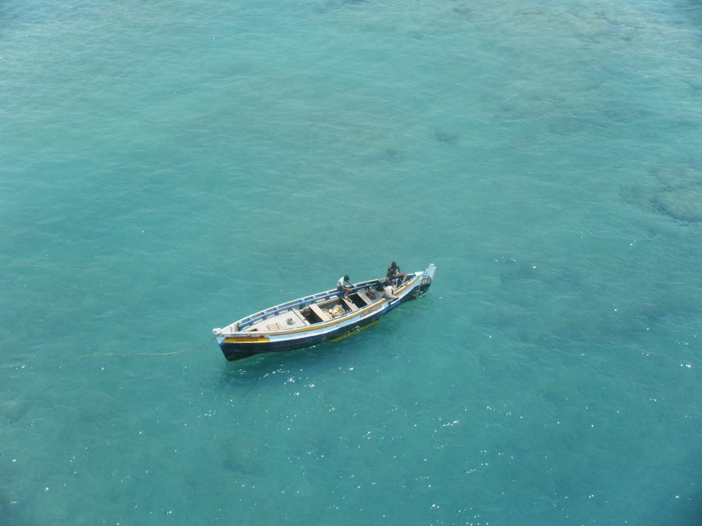

Nature pictures from [Akbar Noormohamed's Unsplash Gallery](https://unsplash.com/@akbarsait)

# Greetings 👋🏾

Akbar Noormohamed
📍 Toronto, Canada | 👨‍👩‍👧‍👦 | Tech Consultant

I build solutions with data and cloud platforms, guided by Agile principles. A dedicated practitioner and continuous learner passionate about the full web-to-data stack.

Firm believer that sharing knowledge and helping others lift everyone up.
Beyond the screen: family, learning, and a loyal Android user 🤖

### 📝 Latest Blog Posts
<!-- BLOG-POST-LIST:START -->👉 <a href="https://akbarsait.com/blog/2025/12/31/a-simple-knowledge-base-with-VuePress/">A Simple Knowledge Base with VuePress</a> 👉 <a href="https://akbarsait.com/blog/2025/05/31/mynotes-understanding-ai-agents-from-scratch/">My Notes - Understanding AI Agents from Scratch</a> 👉 <a href="https://akbarsait.com/blog/2025/04/30/learning-about-ai-agents/">Exploring AI Agents and Related Article Links</a> 👉 <a href="https://akbarsait.com/blog/2025/03/02/using-graphql-with-contentfulcms/">Using GraphQL with Contentful CMS</a> 👉 <a href="https://akbarsait.com/blog/2025/02/09/exploring-and-getting-started-with-contentfulcms/">Exploring and Getting Started with Contentful CMS</a> <!-- BLOG-POST-LIST:END -->
 

  
  &nbsp; 
  &nbsp; 

---
⭐️ From [Akbarsait](https://www.akbarsait.com/) 
